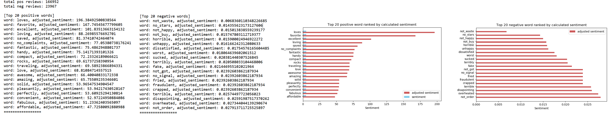

# CZ4045---NLP
Project assignment for NTU CZ4045 Natural Language Processing

### Team
1. Chan Yi Hao ([manzaigit](https://github.com/manzaigit))
2. Calvin Tan Sin Nian ([perennialutopia](https://github.com/perennialutopia))
3. Leung Kai Yiu ([KY-Leung](https://github.com/KY-Leung))
4. Phang Jun Yu ([phangjunyu](https://github.com/phangjunyu))
5. Soh Jun Jie ([sohjunjie](https://github.com/sohjunjie))


## Version information
- Python 3.6


## Contents
- [Placing dataset files](#placing-dataset-files)
- [Project Installation Guide](#project-installation-guide)
- [Usage guide](#usage-guide)


## Placing dataset files
The review dataset file are omitted to save space in project directory. Please place your `CellPhoneReview.json` dataset file in the `dataset/` folder.

## Project Installation Guide
Project setup is as simple as the following 2 steps
#### 1. Install package requirements
The following command will install the required python packages.
```
$ pip install -r requirements.txt
```

#### 2. Download NLTK models
The following NLTK models need to be downloaded to run some of the features provided by the `NLTK` i.e. `pos tagging`. Run the following codes on a python interpreter.
```
>>> import nltk
>>> nltk.download('punkt')
>>> nltk.download('averaged_perceptron_tagger')
>>> nltk.download('wordnet')
>>> nltk.download('stopwords')
>>> nltk.download('conll2000')
```

## Usage guide
This section describes the steps or commands needed for running the code that solves the problems listed in the project assignment. Please ensure the `CellPhoneReview.json` has been placed in the `dataset/` folder before using any of the commands.

#### 1. Dataset Analysis
Execute the following command in `command prompt` to start Dataset Analysis. A trace sample is available [here](results/dataset_analysis/trace.txt)
```
$ python main.py analysis
``` 

#### 2. Noun Phrase Summarizer


#### 3. Sentiment Word Detection
Execute the following command in `command prompt` to start generating the top 20 positive and negative words.
```
$ python main.py sentiment
``` 
A trace sample and graph image of the result can be found in the folder [here](results/sentiment_word_detection/). Please note that for the `trace.txt` the actual console output will differ somewhat as the file does not include console output for printing progress such as `1000 of 190,000 done`.

The following image shows the actual sample trace and graph output you would see when running the `sentiment word detection` algorithm.




#### 4. Application

This tool is written in Java, using Stanford NLP v3.9.1.  
To run the tool, you will need to have Stanford NLP installed. There are many ways to do this, but the following way is recommended if you (i) don't have Maven, (ii) don't want to use the in-built server and (iii) don't want to extract the source files from the jar file

1. Click on [this download link](http://nlp.stanford.edu/software/stanford-corenlp-full-2018-10-05.zip) to download Stanford CoreNLP 3.9.2. Although the tool was written with 3.9.1, there shouldn't be any breaking changes. 
2. Unzip the file.
3. Place 'NegationDetection.java' into the folder named 'stanford-corenlp-full-2018-10-05' (the exact date might be different depending on the version you installed, just update accordingly)
4. Compile and run the code by running the following:

For 3.9.1
```
javac -cp stanford-corenlp-3.9.1.jar:stanford-corenlp-3.9.1-javadoc.jar:stanford-corenlp-3.9.1-models.jar:stanford-corenlp-3.9.1-sources.jar: NegationDetection.java && java -cp stanford-corenlp-3.9.1.jar:stanford-corenlp-3.9.1-javadoc.jar:stanford-corenlp-3.9.1-models.jar:stanford-corenlp-3.9.1-sources.jar: -Xmx1200m NegationDetection
```

For 3.9.2
```
javac -cp stanford-corenlp-3.9.2.jar:stanford-corenlp-3.9.2-javadoc.jar:stanford-corenlp-3.9.2-models.jar:stanford-corenlp-3.9.2-sources.jar: NegationDetection.java && java -cp stanford-corenlp-3.9.2.jar:stanford-corenlp-3.9.2-javadoc.jar:stanford-corenlp-3.9.2-models.jar:stanford-corenlp-3.9.2-sources.jar: -Xmx1200m NegationDetection
```
5. Feel free to modify **testString** to see the different results the tool produce. 
