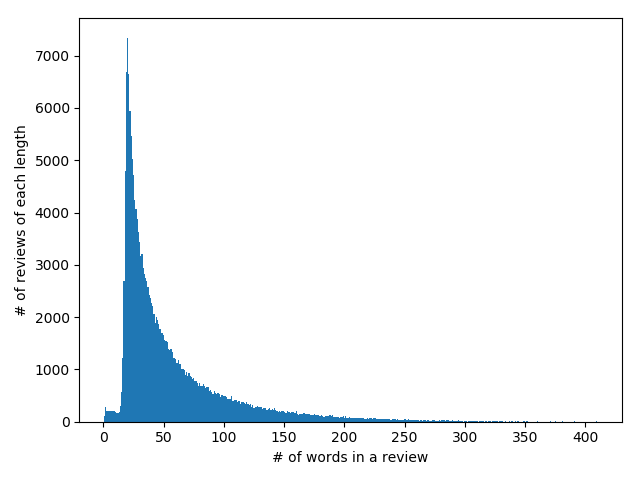

# CZ4045---NLP
Project assignment for NTU CZ4045 Natural Language Processing

### Team
1. Chan Yi Hao ([manzaigit](https://github.com/manzaigit))
2. Calvin Tan Sin Nian ([perennialutopia](https://github.com/perennialutopia))
3. Leung Kai Yiu ([KY-Leung](https://github.com/KY-Leung))
4. Phang Jun Yu ([phangjunyu](https://github.com/phangjunyu))
5. Soh Jun Jie ([sohjunjie](https://github.com/sohjunjie))


## Version information
- Python 3.6


## Contents
- [Placing dataset files](#placing-dataset-files)
- [Project Installation Guide](#project-installation-guide)
- [Usage guide](#usage-guide)
  - [Dataset Analysis](#1-dataset-analysis)
  - [Noun Phrase Summarizer](#2-noun-phrase-summarizer)
  - [Sentiment Word Detection](#3-sentiment-word-detection)
  - [Application](#4-application)


## Placing dataset files
The review dataset file are omitted to save space in project directory. Please place your `CellPhoneReview.json` dataset file in the `dataset/` folder.

## Project Installation Guide
Project setup is as simple as the following 2 steps
#### 1. Install package requirements
The following command will install the required python packages.
```
$ pip install -r requirements.txt
```

#### 2. Download NLTK models
The following NLTK models need to be downloaded to run some of the features provided by the `NLTK` i.e. `pos tagging`. Run the following codes on a python interpreter.
```
>>> import nltk
>>> nltk.download('punkt')
>>> nltk.download('averaged_perceptron_tagger')
>>> nltk.download('wordnet')
>>> nltk.download('stopwords')
>>> nltk.download('conll2000')
```

## Usage guide
This section describes the steps or commands needed for running the code that solves the problems listed in the project assignment. Please ensure the `CellPhoneReview.json` has been placed in the `dataset/` folder before using any of the commands.

#### 1. Dataset Analysis
Execute the following command in `command prompt` to start Dataset Analysis. A trace sample is available [here](results/dataset_analysis/trace.txt)
```
$ python main.py analysis
``` 
The followings are the actual sample trace and graph outputs you would see when running the dataset analysis.
```
Top 10 products with most reviews:
B005SUHPO6    836
B0042FV2SI    690
B008OHNZI0    657
B009RXU59C    634
B000S5Q9CA    627
B008DJIIG8    510
B0090YGJ4I    448
B009A5204K    434
B00BT7RAPG    431
B0015RB39O    424
Name: asin, dtype: int64
```
```
Top 10 reviewers:
A2NYK9KWFMJV4Y    152
A22CW0ZHY3NJH8    138
A1EVV74UQYVKRY    137
A1ODOGXEYECQQ8    133
A2NOW4U7W3F7RI    132
A36K2N527TXXJN    124
A1UQBFCERIP7VJ    112
A1E1LEVQ9VQNK     109
A18U49406IPPIJ    109
AYB4ELCS5AM8P     107
Name: reviewerID, dtype: int64
```
**Sentence Segmentation**


**Sample Sentence Lengths**
```
,asin,overall,reviewText,reviewTime,reviewerID,summary,unixReviewTime,sentencelength
43527,B004Z9W4B0,4,"the product is nice, cute, but not as i expected ...i think there are nicer stuff out there that you can choose form","07 27, 2012",AQIGD6RKS9OJX,"Cute but not as expected",1343347200,1
96469,B008CZO7OU,5,"This was a gift for the father-in-law & he's not always easy to please.  As always Seidio does a great job.  The case is slim, buttons press easily & it looks great as well as protects.","02 6, 2013",A1S48ANGFTOCM9,"Great case.",1360108800,3
55198,B005LFXBJG,4,"I have these plugged in all over my house and never had a problem with them. I like to get OEM chargers because they seem to last longer than knockoffs.","06 20, 2013",A2L9DBKBXLGHOL,"Never have enough",1371686400,2
137800,B00AGABISW,5,"I seriously buy a lot of phone cases and screen protectors.  These screen protectors last the longest for me so far.  Easy to put on and they stay. In. Place.  You get three but the one has been on my phone for months.  Spend the money on these.  They're worth it.  They are easy to install.  You'll need the right environment so a construction site is a no-no.  They supply you with the dust remover tape so that is a giant plus. Edit Sept 10, 2013:I've just removed my first one since it was a little beat up.  I've dropped a few things on my screen (not on purpose, c'mon...)and I had to replace it.  Took 3 minutes.  No dust under the screen.  At.  All. Hint:  After you clean your screen.  Use the provided tape remover tabs to get the stragglers and you shouldn't have to lift up the protector.","06 4, 2013",A2W88VUGI6DMEM,The best so far,1370304000,19
167960,B00DZ62K18,3,"Out of the box there was one thing I really liked about the M2 and M3 Bolse series was the fact that they had digital displays indicating the amount of charge left in the battery pack. I was pleased because this innovative design will allow the user to know exactly how much juice is left in the battery.  The LEDs are nice but as a rule, you'll only see three or four of them and the range of charge can be wide.  I'm used to working with these batteries and keep them charged up.  However, if you have one and only have 1 LED remaining, you may have a 1% charge or a 24% charge.  If you had a fuel gauge like that in a car, you might be driving on 1/4 of a tank or fumes.  Novel idea and I really liked it. I liked the promise of this battery, as well as the M2, until I started to test them.  I cannot speak for anyone else, but I test every battery I get ... in real-time circumstances.  I use my iPad a lot and when it's powered down sufficiently I start testing.  I figured a 6600mAh battery would be able to do a sufficient job powering up an iPad with a 46% charge remaining. The M3 struggled from the start with an immediate drop in charge from 97% down to 65% in fifteen minutes.  It was then I decided to watch and record very closely what was going on. A casual approach is usually my thing, but instead of a stellar performance I'd expect from a 6600mAh battery pack, I only got an average one.  Bolse is usually a performer, but for some reason the M2 and M3 battery packs fell a bit short of my expectations.  The performance was OK, but nothing more.  If you want a Bolse, which is an excellent brand, I'd look at the AON series, which really performed spectacularly.  I'm rating this one a three, which is OK, on the Amazon scale. Bolse M3 (6600mAh) - 97% charged at startiPad - 46% charge at start15 minutes -  51%  (65%)30 minutes -  56%  (58%)45 minutes -  61%  (55%)60 minutes -  66%  (51%)75 minutes -  71 % (39%)90 minutes -  76%  (37%)120 minutes - 82% (19%)135 minutes - 85%  (LO)150 - The M3 stopped charging at this pointWHAT'S IN THE BOX:~ 1 Bolse M3 External Battery~ 3 connectors~ 1 Micro USB power cable~ 1 velvet-like travel pouch~ Quick start guideSPECS:~ Battery type: Li-ion battery~ Life cycle: ~500 cycles~ Input current:  800mAh~ Output current:Output USB1:  for iPad / iPhoneOutput USB2 for All Smartphones2A total max~ Capacity:  6600mAh~ Size: 4.13 x 2.36 x 0.71 inches~  Weight:  5.76 ounces~  Certifications:  CE & FCC & ROHSWarranty:  12 months limitedSample provided for review.","08 22, 2013",ACJT8MUC0LRF0,"The M3 has an innovative design with the Smart digital display, but falls short in performance ...",1377129600,19
```

**Tokenized words without stemming**



**Tokenized words with stemming**


**Top 20 most frequent words**
```
Before stemming
 [('phone', 174958), ('case', 146050), ('one', 86759), ('like', 71853), ('great', 66874), ('would', 66809), ('use', 61676), ('screen', 60145), ('good', 58601), ('battery', 57976), ('well', 51149), ('iphone', 47691), ('get', 46380), ('charge', 44897), ('charger', 38646), ('product', 38223), ('really', 38055), ('also', 37145), ('time', 36661), ('works', 32743)]

 After stemming
 [('phone', 192494), ('case', 165228), ('use', 118087), ('one', 92736), ('charg', 92539), ('like', 79743), ('work', 76325), ('great', 66912), ('would', 66814), ('batteri', 66237), ('screen', 61812), ('get', 61243), ('good', 58823), ('look', 52093), ('well', 51161), ('iphon', 50521), ('fit', 50296), ('time', 48381), ('charger', 45281), ('protect', 44734)]
```
**POS Tagging**
```
it looked good but did not fit properly the volume would change without touching the buttons and the vibrate switch was partially covered buy a different bumper they are all much better => [('it', 'PRP'), ('looked', 'VBD'), ('good', 'JJ'), ('but', 'CC'), ('did', 'VBD'), ('not', 'RB'), ('fit', 'VB'), ('properly', 'RB'), ('the', 'DT'), ('volume', 'NN'), ('would', 'MD'), ('change', 'VB'), ('without', 'IN'), ('touching', 'VBG'), ('the', 'DT'), ('buttons', 'NNS'), ('and', 'CC'), ('the', 'DT'), ('vibrate', 'NN'), ('switch', 'NN'), ('was', 'VBD'), ('partially', 'RB'), ('covered', 'VBN'), ('buy', 'VB'), ('a', 'DT'), ('different', 'JJ'), ('bumper', 'NN'), ('they', 'PRP'), ('are', 'VBP'), ('all', 'DT'), ('much', 'RB'), ('better', 'JJR')]

bought for my security system, and works just like the original => [('bought', 'NN'), ('for', 'IN'), ('my', 'PRP$'), ('security', 'NN'), ('system', 'NN'), ('and', 'CC'), ('works', 'VBZ'), ('just', 'RB'), ('like', 'IN'), ('the', 'DT'), ('original', 'JJ'), ('when', 'WRB'), ('this', 'DT'), ('one', 'CD'), ('goes', 'VBZ'), ('bad', 'JJ'), ('it', 'PRP'), ('is', 'VBZ'), ('a', 'DT'), ('battery', 'NN'), ('after', 'IN'), ('all', 'DT'), ('i', 'NN'), ('will', 'MD'), ('get', 'VB'), ('another', 'DT'), ('right', 'NN'), ('here', 'RB')]

this battery pack is amazing  ive owned this for a year now and used it plenty of times it charges my iphone 5 to a full charge many times  that says
a lot  it is very handy when you cannot find an outlet for your phone or anything usb related charging needs  great for camping and also excellent when you have to use your phone while it is charging and do not want to be stuck next to an outlet with your short iphone charging cable => [('this', 'DT'), ('battery', 'NN'), ('pack', 'NN'), ('is', 'VBZ'), ('amazing', 'JJ'), ('ive', 'JJ'), ('owned', 'VBN'), ('this', 'DT'), ('for', 'IN'), ('a', 'DT'),
('year', 'NN'), ('now', 'RB'), ('and', 'CC'), ('used', 'VBD'), ('it', 'PRP'), ('plenty', 'NN'), ('of', 'IN'), ('times', 'NNS'), ('it', 'PRP'), ('charges', 'VBZ'), ('my', 'PRP$'), ('iphone', 'NN'), ('5', 'CD'), ('to', 'TO'), ('a', 'DT'), ('full', 'JJ'), ('charge', 'NN'), ('many', 'JJ'), ('times', 'NNS'), ('that', 'WDT'), ('says', 'VBZ'), ('a', 'DT'), ('lot', 'NN'), ('it', 'PRP'), ('is', 'VBZ'), ('very', 'RB'), ('handy', 'JJ'), ('when', 'WRB'), ('you', 'PRP'), ('can', 'MD'), ('not', 'RB'), ('find', 'VB'), ('an', 'DT'), ('outlet', 'NN'), ('for', 'IN'), ('your', 'PRP$'), ('phone', 'NN'), ('or', 'CC'), ('anything', 'NN'), ('usb', 'JJ'), ('related', 'JJ'), ('charging', 'VBG'), ('needs', 'VBZ'), ('great', 'JJ'), ('for', 'IN'), ('camping', 'VBG'),
('and', 'CC'), ('also', 'RB'), ('excellent', 'JJ'), ('when', 'WRB'), ('you', 'PRP'), ('have', 'VBP'), ('to', 'TO'), ('use', 'VB'), ('your', 'PRP$'), ('phone', 'NN'), ('while', 'IN'), ('it', 'PRP'), ('is', 'VBZ'), ('charging', 'VBG'), ('and', 'CC'), ('do', 'VBP'), ('not', 'RB'), ('want', 'VB'), ('to', 'TO'), ('be', 'VB'), ('stuck', 'VBN'), ('next', 'JJ'), ('to', 'TO'), ('an', 'DT'), ('outlet', 'NN'), ('with', 'IN'), ('your', 'PRP$'), ('short', 'JJ'), ('iphone', 'NN'), ('charging', 'VBG'), ('cable', 'NN')]

love these screen protectors  the antiglarefingerprint feature works great  i use my phone all the time so it is nice to have something to protect the screen => [('love', 'IN'), ('these', 'DT'), ('screen', 'JJ'), ('protectors', 'NNS'), ('the', 'DT'), ('antiglarefingerprint', 'NN'), ('feature', 'NN'), ('works', 'VBZ'), ('great', 'JJ'), ('i', 'NN'), ('use', 'VBP'), ('my', 'PRP$'), ('phone', 'NN'), ('all', 'PDT'), ('the', 'DT'), ('time', 'NN'), ('so', 'IN'), ('it', 'PRP'), ('is', 'VBZ'), ('nice', 'JJ'), ('to', 'TO'), ('have', 'VB'), ('something', 'NN'), ('to', 'TO'), ('protect', 'VB'), ('the', 'DT'), ('screen', 'NN')]

thanks bought  3 different colors  fit like a glove  protects well and looks very nice came fast and we are very very pleased with them thank you => [('thanks', 'NNS'), ('bought', 'VBD'), ('3', 'CD'), ('different', 'JJ'), ('colors', 'NNS'), ('fit', 'VBP'), ('like', 'IN'), ('a', 'DT'), ('glove', 'NN'), ('protects', 'VBZ'), ('well', 'RB'), ('and', 'CC'), ('looks', 'VBZ'), ('very', 'RB'), ('nice', 'JJ'), ('came', 'VBD'), ('fast', 'RB'), ('and', 'CC'), ('we', 'PRP'), ('are', 'VBP'), ('very', 'RB'), ('very', 'RB'), ('pleased', 'JJ'), ('with', 'IN'), ('them', 'PRP'), ('thank', 'VBP'), ('you', 'PRP')]
```

#### 2. Noun Phrase Summarizer
Execute the following command in `command prompt` to start generating the top 20 positive and negative words.
```
$ python main.py nounphrase
``` 
A trace sample is available [here](results/noun_phrase_summarizer/trace.txt). In our experiment, we ran the program using two different types of taggers. The final one used will be the RegExp Parser which is the default mode. If you wish to run it with the ConsecutiveNPChunk tagger simply uncomment the line which sets the mode to "chunktagger". Similarly, there is a set of data that was cleaned of URLs but was not uploaded due to size restrictions. The difference is minimal but the data can be cleaned by uncommenting the line "save_clean_dataset()" and the line after it.

#### 3. Sentiment Word Detection
Execute the following command in `command prompt` to start generating the top 20 positive and negative words.
```
$ python main.py sentiment
``` 
A trace sample and graph image of the result can be found in the folder [here](results/sentiment_word_detection/). Please note that for the `trace.txt` the actual console output will differ somewhat as the file does not include console output for printing progress such as `1000 of 190,000 done`.

The following image shows the actual sample trace and graph output you would see when running the `sentiment word detection` algorithm.


#### 4. Application

This tool is written in Java, using Stanford NLP v3.9.1.  
To run the tool, you will need to have Stanford NLP installed. There are many ways to do this, but the following way is recommended if you (i) don't have Maven, (ii) don't want to use the in-built server and (iii) don't want to extract the source files from the jar file

1. Click on [this download link](http://nlp.stanford.edu/software/stanford-corenlp-full-2018-10-05.zip) to download Stanford CoreNLP 3.9.2. Although the tool was written with 3.9.1, there shouldn't be any breaking changes. 
2. Unzip the file.
3. Place 'NegationDetection.java' into the folder named 'stanford-corenlp-full-2018-10-05' (the exact date might be different depending on the version you installed, just update accordingly)
4. Compile and run the code by running the following:

For 3.9.1
```
javac -cp stanford-corenlp-3.9.1.jar:stanford-corenlp-3.9.1-javadoc.jar:stanford-corenlp-3.9.1-models.jar:stanford-corenlp-3.9.1-sources.jar: NegationDetection.java && java -cp stanford-corenlp-3.9.1.jar:stanford-corenlp-3.9.1-javadoc.jar:stanford-corenlp-3.9.1-models.jar:stanford-corenlp-3.9.1-sources.jar: -Xmx1200m NegationDetection
```

For 3.9.2
```
javac -cp stanford-corenlp-3.9.2.jar:stanford-corenlp-3.9.2-javadoc.jar:stanford-corenlp-3.9.2-models.jar:stanford-corenlp-3.9.2-sources.jar: NegationDetection.java && java -cp stanford-corenlp-3.9.2.jar:stanford-corenlp-3.9.2-javadoc.jar:stanford-corenlp-3.9.2-models.jar:stanford-corenlp-3.9.2-sources.jar: -Xmx1200m NegationDetection
```
5. Feel free to modify **testString** to see the different results the tool produce. 
